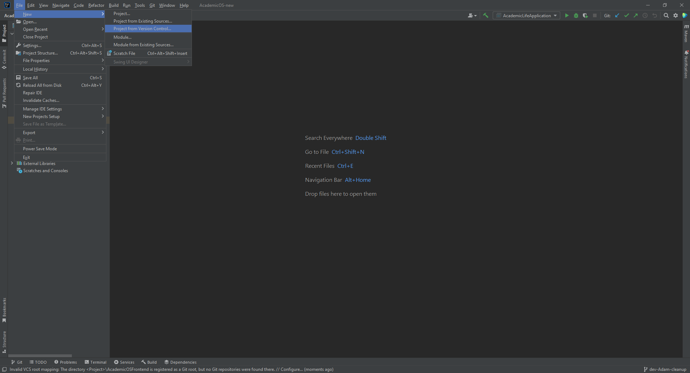
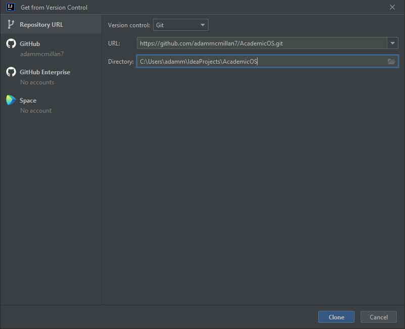
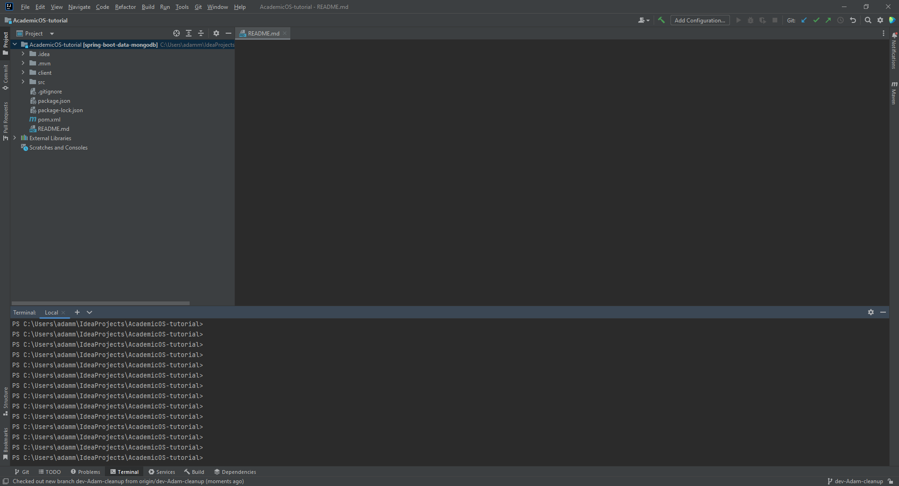
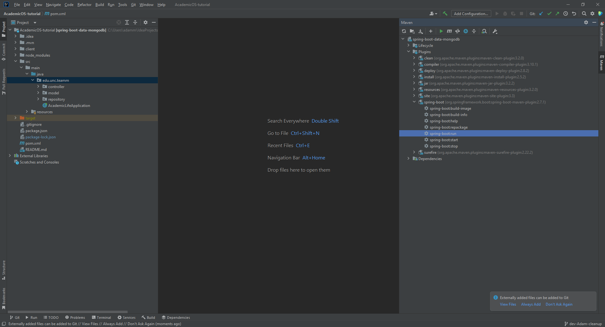

# Installation

### Prerequisites
1. Windows or Mac OS
2. Your java-supporting IDE of choice. This guide will use [IntelliJ Community Edition](https://www.jetbrains.com/idea/). 

### Clone the repository
1. Open your IDE and create a new project "from version control."

2. Input "https://github.com/adammcmillan7/AcademicOS.git" as the source URL and click clone.

### Install node.js dependencies
1. Open the terminal on the lower left corner.

2. Run the command
`npm install`
This will install dependencies of tools used in our project.

1. Navigate to the 'client' folder using
`cd client`
2. Again run
`npm install`

The project is successfully installed! You can now run the project.

# Running the Application

The application is split into front end and back end servers. You can run each independently, but many front end functional features will not work correctly if the back end server is not running,

## Running the Back End Server
This process is fairly simple. From the maven tab on the right side, open plugins, then open spring-boot. To run the back end, double click on spring-boot:start. However, if you have not run the project before, instead you must double click spring-boot:run. In the future, you can simply run spring-boot:start. To close the server, use spring-boot:stop.

Now that the back end is running, you can manipulate the database with a tool like Postman or MongoDB Compass, or also run the front-end to see the entire project.

## Running the Front End Server
Navigate to the 'client' folder using `cd client`. Start the React server by running  `npm start`. This will open the application in a browser window.
